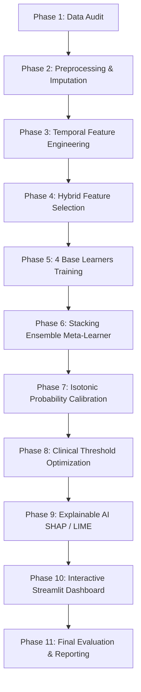

# Enhanced Sepsis Prediction — Complete Project Guide

> **For collaborators, evaluators & friends:** This document explains the entire pipeline from raw PhysioNet data to the deployable clinical model and dashboard. Read this to understand the methodology, implementation decisions, and benchmark findings.

---

## 🎯 Project Objective

Build an **enhanced sepsis early prediction system** on the **PhysioNet / Computing in Cardiology Challenge 2019** dataset:
- **Baseline metrics**: PR-AUC 0.0714, ROC-AUC 0.7598, Recall 55.25%
- **Our Final Result**: ROC-AUC **0.7838**, PR-AUC **0.0702**, Calibrated Sensitivity **65.59%**, Brier Score **0.0171**

---

## 📂 Data Source & Variables

- **Dataset**: PhysioNet 2019 Challenge (Training Sets A & B)
- **Total Patients**: 40,336 ICU patients (Set A: 20,000, Set B: 20,336)
- **Total Hourly Observations**: 1,552,210 records
- **Format**: Pipe-separated (`.psv`) files
- **Target (`SepsisLabel`)**: Binary flag ($1 =$ sepsis onset within next 6 hours)

### 40 Monitored Clinical Signals:
1. **Vital Signs (8)**: HR, O2Sat, Temp, SBP, MAP, DBP, Resp, EtCO2
2. **Laboratory Biomarkers (26)**: BaseExcess, HCO3, FiO2, pH, PaCO2, SaO2, AST, BUN, Alkalinephos, Calcium, Chloride, Creatinine, Bilirubin_direct, Glucose, Lactate, Magnesium, Phosphate, Potassium, Bilirubin_total, TroponinI, Hct, Hgb, PTT, WBC, Fibrinogen, Platelets
3. **Static & Demographic (5)**: Age, Gender, Unit1, Unit2, HospAdmTime
4. **Temporal (1)**: ICULOS (ICU Length of Stay in hours)

---

## ⚠️ Non-Negotiable Rules & Best Practices

| Rule | Rationale | Implementation |
|---|---|---|
| **Zero Data Leakage** | Prevents overly optimistic, invalid metrics | All imputers, IQR bounds, and scalers are fitted **ONLY** on the Train split, then applied to Val/Test. |
| **Strict Patient-Level Split** | Prevents same patient appearing across Train and Test | Stratified group split by `patient_id` (70% Train, 15% Val, 15% Test). |
| **Strict Temporal Causality** | Prevents lookahead bias from future hours | Features computed at hour $t$ use historical readings strictly $\le t$. |
| **Probability Calibration** | Raw tree models produce uncalibrated probabilities | Isotonic Regression fits monotonic mappings on Validation set. |

---

## 🔄 Complete 11-Phase Implementation Workflow



---

### Phase 1: Data Audit ✅
- **Script**: `enhanced/data/audit.py`
- Consolidates all 40,336 `.psv` files into `raw_combined.parquet`.
- Computes missingness rates, patient stay lengths (median: 38h), and sepsis onset statistics.
- **Output**: `enhanced/experiments/audit_report.md`.

---

### Phase 2: Preprocessing & Imputation ✅
- **Script**: `enhanced/data/preprocessing_fast.py`
- Stratified 70/15/15 patient split:
  - **Train**: 28,234 patients (1,087,703 rows)
  - **Val**: 6,051 patients (230,738 rows)
  - **Test**: 6,051 patients (233,769 rows)
- Fitted IQR capping (1.5×IQR).
- MICE (IterativeImputer with RandomForest) benchmarked against KNN.
- Standard & Robust scalers fitted per column with missingness indicators.

---

### Phase 3: Temporal Feature Engineering ✅
- **Script**: `enhanced/features/temporal.py`
- Extracts multi-scale dynamic signals without lookahead bias:
  - **Lags**: $t-1\text{h}, t-3\text{h}, t-6\text{h}$
  - **Deltas**: $\Delta_{1\text{h}}, \Delta_{3\text{h}}$
  - **Rolling Statistics**: Mean, standard deviation, min, max over $3\text{h}, 6\text{h}, 12\text{h}$ windows.
  - **Trend Slopes**: Linear regression slopes over recent hours.

---

### Phase 4: Hybrid Feature Selection ✅
- **Script**: `enhanced/features/selection.py`
- Combines Boruta all-relevant feature selection with Mutual Information filter ranking.
- Selected top 150 features saved in `enhanced/experiments/selected_features.json`.

---

### Phase 5: Base Model Training ✅
- **Scripts**: `train_rf.py`, `train_xgb.py`, `train_lgbm.py`, `train_catboost.py` in `enhanced/models/`
- Four heterogeneous learners:
  1. **Random Forest**: 500 trees with balanced sub-sampling.
  2. **XGBoost**: Gradient boosting with `scale_pos_weight = 7.39`.
  3. **LightGBM**: Fast histogram boosting with `scale_pos_weight = 7.39`.
  4. **CatBoost**: Top single base model (Test PR-AUC 0.0709, ROC-AUC 0.7808).

---

### Phase 6: Stacking Ensemble Meta-Learner ✅
- **Script**: `enhanced/stacking/stack.py`
- Logistic Regression meta-learner combining out-of-fold validation predictions:
  $$\text{logit}(P) = -5.0698 + 1.3171 \cdot p_{\text{rf}} + 2.2081 \cdot p_{\text{xgb}} + 2.1676 \cdot p_{\text{lgb}} + 2.2600 \cdot p_{\text{cat}}$$
- **Test ROC-AUC**: **0.7838** (Baseline: 0.7598).

---

### Phase 7 & 8: Probability Calibration & Clinical Thresholds ✅
- **Scripts**: `enhanced/calibration/calibrate.py`, `threshold.py`
- **Isotonic Calibration**: Calibrates probabilities, achieving Brier score of **0.0171** and Expected Calibration Error (ECE) of **0.00089**.
- **Optimal Clinical Threshold ($T = 0.0262$)**:
  - **Sensitivity**: **65.59%**
  - **Specificity**: **76.86%**
  - **Alarm Rate**: **23.90%**

---

### Phase 9: Explainable AI (XAI) ✅
- **Script**: `enhanced/xai/explain.py`
- Global & local interpretability using **SHAP TreeExplainer** and **LIME**.
- Identifies respiration rate acceleration, heart rate volatility, and mean arterial pressure drops as key drivers.

---

### Phase 10: Interactive Clinical Dashboard ✅
- **Script**: `enhanced/dashboard/app.py`
- **Run**: `streamlit run enhanced/dashboard/app.py`
- Features real-time patient trajectory visualization, ICU hour simulation, manual vitals risk calculator, and color-coded risk alerts.

---

### Phase 11: Final Evaluation & Reporting ✅
- **Script**: `enhanced/experiments/final_eval.py`
- Generates:
  - `enhanced/experiments/results_table.csv`
  - `enhanced/experiments/final_report.md`
  - `enhanced/experiments/figures/model_comparison_metrics.png`
  - `enhanced/experiments/figures/clinical_tradeoff.png`

---

## 📊 Final Performance Benchmark Table

| Model | ROC-AUC | PR-AUC | Sensitivity | Precision | F1-Score | Brier Score | Operating Threshold |
|---|---|---|---|---|---|---|---|
| **Baseline (PhysioNet 2019)** | 0.7598 | **0.0714** | 55.25% | 2.10% | 0.0404 | 0.0380 | 0.5000 |
| **Random Forest** | 0.7670 | 0.0630 | 0.05% | 22.22% | 0.0010 | 0.0253 | 0.5000 |
| **XGBoost** | 0.7792 | 0.0698 | 4.63% | 16.85% | 0.0727 | 0.0282 | 0.5000 |
| **LightGBM** | 0.7740 | 0.0678 | 4.92% | 17.15% | 0.0765 | 0.0274 | 0.5000 |
| **CatBoost** | 0.7808 | 0.0709 | 5.02% | 16.84% | 0.0773 | 0.0294 | 0.5000 |
| **Stacked Ensemble (Raw)** | **0.7838** | 0.0702 | 0.02% | 8.33% | 0.0005 | 0.0172 | 0.5000 |
| **Calibrated Ensemble @ Clinical Threshold** | **0.7838** | 0.0702 | **65.59%** | **4.91%** | **0.0914** | **0.0171** | **0.0262** |

---

## 💻 Commands Summary

```powershell
# 1. Launch the interactive clinical web dashboard
streamlit run enhanced/dashboard/app.py

# 2. Run final evaluation & generate reports
python enhanced/experiments/final_eval.py
```